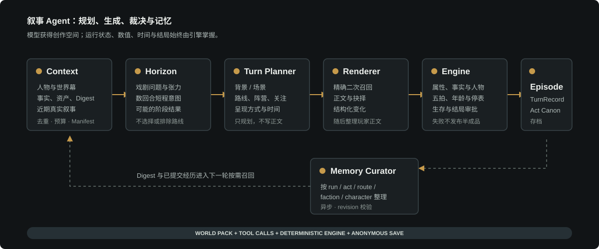

# Life Remake

> 真正可控的叙事 Agent，让每一段 TRPG 人生不再漂移。

**Life Remake** 是一个以人生经历为载体的可控叙事游戏。玩家定义人物、选择天赋并在关键时刻作出抉择；模型负责叙事视角与文字表现，规则引擎负责主线节拍、事实、数值、存档和结局审批。

[官方体验站（持续更新）](http://47.98.121.127/) · [快速开始](#快速开始) · [架构说明](./docs/ARCHITECTURE.md) · [使用流程](./docs/USAGE_FLOW.md)



## 为什么是“可控叙事 Agent”

纯文本角色扮演常见的问题，是模型要么只会顺着最近一句话续写，要么为了保持连续性把玩家带入无法验证的路线。Life Remake 将创作与裁决拆开：

- **模型选择叙事视角，不直接改写游戏规则。** 每回合模型从当前世界包的完整路线与阵营目录中选择视角，并提交背景、场景或抉择；引擎只接受世界包中存在的 ID。
- **工具调用承载协议，正文只承载体验。** 模型通过 `render_background_segment`、`render_scene` 或 `render_choice_scene` 提交结构化回合；玩家界面只显示自然叙事、抉择与已结算结果。
- **世界主线约束人生走向。** 当前“古代权谋”世界由案起入局、立身周旋、大局担当三幕递进；每幕都允许路线自由切换，但必须走完 `setup -> escalation -> pressure -> climax -> payoff` 才能进入下一幕。
- **状态始终由引擎保存和审批。** 世界幕节拍、人物事实、属性、天赋、命运人物、抉择代价、生存危机和结局蓝图都在本地规则层维护，不暴露为前端标签或模型的自由文本。

这不是把大段事件列表一次塞给模型，也不是用固定脚本替代生成。模型在世界、角色和近期叙事的压缩上下文中自由选择当前经历视角；引擎记录世界幕节拍、已发生事实和受控后果，使所有场景服务于同一条世界主线。

## 游戏体验

玩家看到的是一条可向上回看的自然人生时间线：平缓年份沉淀成长、关系和余波，矛盾逐渐累积为连续场景，并在关键处给出具体的选择。

- 开局设定人设、五维属性和天赋卡。
- 普通年份按叙事节拍推进，不显示内部路线、标签或工具记录。
- 重大矛盾可以停留在同龄连续抉择中，避免为了年份刻度打断冲突。
- 同一世界中可以在不同经历之间自然切换；未完成的伏笔与关系会留在后续上下文中。
- 体魄长期低于当前年龄阶段的风险线时，才可能进入生存危机；玩家可以选择自愈、请求帮助或听天由命。失败才会死亡并进入带死因的结算。
- 主线完成后，模型只能申请收束；引擎结合属性、天赋、历史代价与名望锁定好、普通或坏结局的方向。

### 当前完整世界：古代权谋

古代世界不是六条互斥的职业线。家门、仕途、商路、法度、边地与人情等经历始终开放，模型根据当下人物、已发生事实和当前世界幕选择视角；它们共同把人物带过三层递进的矛盾：

1. **案起入局**：从自身身份和生活中接触一桩案件、制度裂缝或未被承担的现实矛盾；案由可以是新事，也可以带着旧线索。
2. **立身周旋**：承接前一幕的后果，进入阵营、组织、地方势力或关系网络，在新的位置面对独立矛盾。
3. **大局担当**：让前两幕积累的身份、人物和代价进入更大范围的危机；危机可以是外患、灾乱、政局失序或民生困局，并由人物的现实位置决定承担尺度。

每幕由 `setup -> escalation -> pressure -> climax -> payoff` 的全局节拍承载。模型每拍都可更换经历视角；`payoff` 完成当前世界幕，人物、事实、属性和历史抉择则继续带入下一幕。

## Agent 运行链路

```text
压缩消息 + 世界包 + 已发生事实 + 路线/阵营目录
                    |
                    v
模型工具调用（背景 / 场景 / 抉择）
                    |
                    v
引擎审核世界 ID、属性语义、人物引用、事实与年龄
                    |
                    v
引擎校验并结算 -> TurnRecord -> 流式时间线 / 存档
```

当三幕世界主线完成，模型工具集切换为 `request_story_closure`。它只能申请结局，不能自行宣布结束；引擎审核前置事实与收束状态，锁定结局蓝图后再生成结算文本。

这套分层参考了沉浸式文本应用中“固定指令、短期上下文、按需世界条目”的组织方式，但不把聊天运行时当作游戏状态机。世界、事实和路线索引由项目自身维护，因此可以审查、测试和扩展。

## 界面预览

游戏截图会维护在 [`docs/assets/readme/screenshots`](./docs/assets/readme/screenshots/README.md)。该目录已预留时间线、抉择和结算画面的命名规范，后续发布可直接补入图片而无需重排 README。

## 核心能力

| 能力 | 说明 |
| --- | --- |
| 可控叙事 | 单次 `tool_call`：模型提交背景、场景或抉择；引擎审批受控状态，正文只服务于玩家体验。 |
| 世界主线 | 世界包定义主线幕、路线目录、阵营、Lore、事实与结局蓝图；引擎不绑定古代世界。 |
| 幕间节拍 | 每个世界幕保存 `setup -> escalation -> pressure -> climax -> payoff`；模型每拍都可自由切换路线视角。 |
| 原子回合 | `TurnRecord` 固化每个已结算回合的文本、抉择、公开属性快照和年龄范围，前端只读取该公开投影。 |
| 生存危机 | 年度体魄风险经宽限期与年龄阶段规则审核后才出现；三种求生选择以智力、魅力或气运档位结算。 |
| 天赋与人物 | 玩家仅携带已选的 1 至 3 张天赋卡进入模型上下文；可回归人物使用稳定身份引用，前端以“命运人物”投影展示。 |
| 匿名存档 | 无需账号即可保存、恢复、删除分支存档，并可通过恢复码在新的匿名会话中恢复。 |
| 流式体验 | 后端以 NDJSON 推送已完成的回合，前端以独立可滚动的阅读时间线呈现。 |

## 快速开始

### 环境

- Windows 10/11
- Node.js `24.x`（项目当前开发与验证环境：Node `24.14.0`、npm `11.9.0`）
- 一个支持 OpenAI 兼容 Chat Completions 的模型服务 API Key

### 一键启动

1. 克隆或下载本仓库并进入项目根目录。
2. 双击 `start-local.bat`，或在 PowerShell 中执行：

   ```powershell
   .\start-local.bat
   ```

3. 首次运行时，脚本会在依赖缺失时安装依赖，并由 `apps/backend/.env.example` 自动创建 `apps/backend/.env`。
4. 浏览器打开 `http://localhost:5173`，在 Setting 中填写 API Key、服务地址和模型名，确认本局环境后开始游戏。

脚本会释放本项目使用的 `5173` 和 `4000` 端口后启动前后端开发链路。已有其他服务占用这两个端口时，请先确认可以关闭它们。

### 模型配置

当前对外支持 **OpenAI 兼容的 `/chat/completions`** 接口。默认模板已配置为：

```dotenv
DEFAULT_PROVIDER_BASE_URL=https://api.deepseek.com
DEFAULT_PROVIDER_MODEL=deepseek-v4-flash
DEFAULT_PROVIDER_API_PATH=/chat/completions
```

本地模式下，API Key 随当前游戏会话提交给后端进程使用，不写入项目的持久化存档；浏览器只记住服务地址、模型等非密钥配置。请勿将含有真实密钥的 `.env` 或运行时配置提交到版本库。

## 存档与数据

- 浏览器通过 HttpOnly 匿名会话 Cookie 识别当前玩家，不需要注册或登录。
- 当前局、存档槽和存档快照存储于 `storage/anonymous-game-store.json`；运行中的局默认保留 7 天，匿名会话默认 30 天，存档默认 180 天。具体期限和槽位数可通过 `ANONYMOUS_*` 环境变量调整。
- 每个匿名会话默认最多 5 个存档。恢复一个存档会创建新的当前局，原存档保留为分支点；恢复码可把存档带到新的匿名会话。
- “重置匿名存档”会清除当前匿名会话下的运行局和全部存档，使浏览器回到新用户状态。

公开部署时，请将 `storage/` 放在持久化磁盘或卷上。项目当前的文件仓储适合单后端实例；扩展为多实例前，应在保留存储接口的前提下替换为共享仓储。

## 扩展一个新世界

引擎不依赖古代世界的路线数、名称或年龄边界。新世界可通过世界包扩展，而不需要重写核心叙事状态机：

1. 新建 `data/narratives/<worldId>.story.json`，定义世界背景、`mainlineActs`、`routeArcs`、人物、Lore、事实与结局蓝图。
2. 将现有事件素材与路线和局部节拍关联，保持事件 ID 可追踪。
3. 补充世界线、阵营、天赋与事件元数据，并用现有共享契约校验内容。

当前完整实现的是古代权谋世界。奇幻与现代世界会由项目维护者持续扩展；世界包的组织方式已经作为公开扩展接口保留。

详细的内容制作说明见 [小说蒸馏与世界包指南](./docs/NOVEL_DISTILLATION_GUIDE.md) 和 [配置指南](./docs/CONFIG_GUIDE.md)。

## 工程与技术栈

```text
apps/
  backend/   Express + TypeScript：流式 API、规则引擎、工具审批、存档仓储、模型适配
  frontend/  React 18 + Vite：阅读器时间线、抉择、存档与本地模型设置
packages/
  shared/    TypeScript 共享契约：运行态、工具载荷、TurnRecord、世界包结构
data/        世界线、叙事世界包、事件、阵营、天赋等数据素材
storage/     单实例运行期存档与配置（不应提交）
```

- **语言与运行时**：TypeScript、Node.js
- **AI 应用能力**：OpenAI Compatible API、受控 function calling、结构化输出、分层消息上下文、工具结果审批
- **游戏引擎能力**：数据驱动世界包、事实账本、局部路线节拍、属性与代价结算、双向结局蓝图
- **交付体验**：React、Vite、Express、NDJSON 流、匿名会话与存档恢复

## 文档

- [架构与运行链路](./docs/ARCHITECTURE.md)
- [技术细节](./docs/TECHNICAL.md)
- [使用流程](./docs/USAGE_FLOW.md)
- [模型与运行配置](./docs/CONFIG_GUIDE.md)
- [世界包和素材制作](./docs/NOVEL_DISTILLATION_GUIDE.md)
- [更新日志](./docs/CHANGELOG.md)
- [开发日志](./docs/DEV_LOG.md)

## 许可与第三方服务

本项目代码采用 [MIT License](./LICENSE)。通过本项目调用的模型服务由使用者自行选择和配置，费用、数据处理与输出使用应遵守对应服务商的条款。项目依赖保留各自许可证。

Life Remake 正在持续迭代中，欢迎保持期待。
