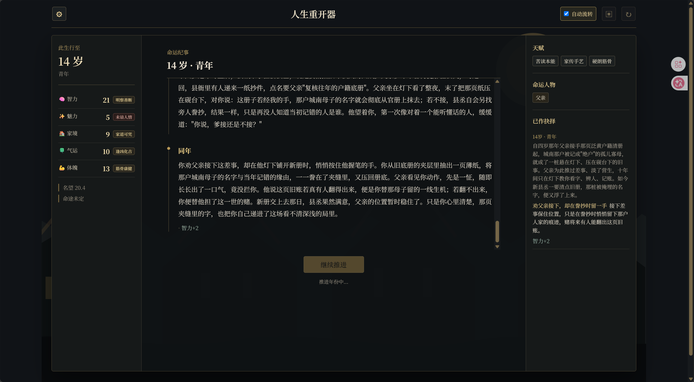
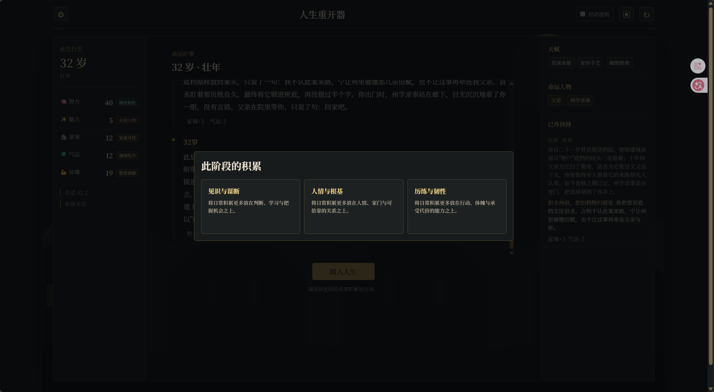
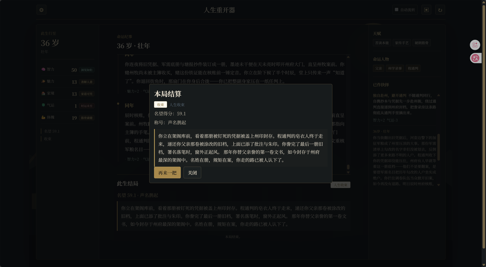
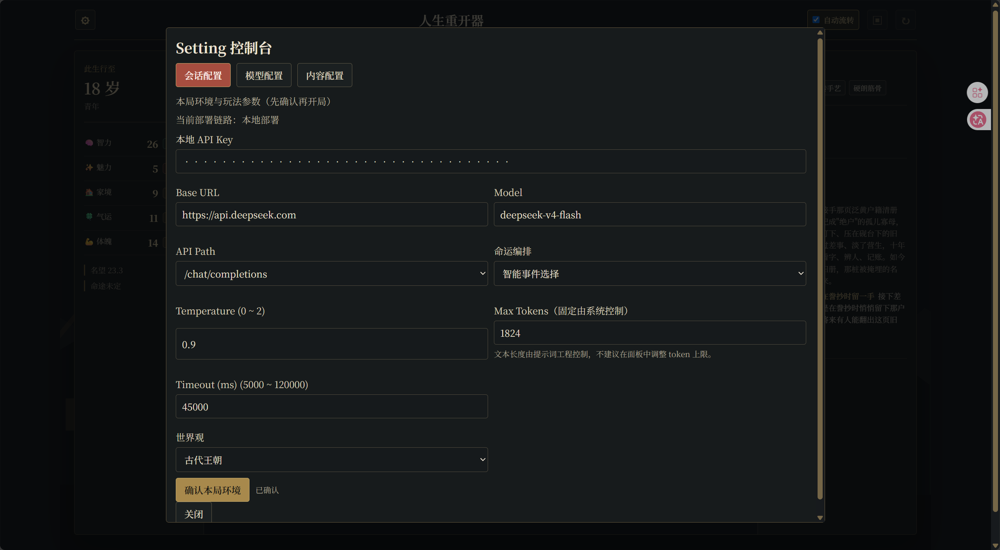

# Life Remake


> 真正可控的叙事 Agent，让每一段 TRPG 人生不再漂移。

**Life Remake** 是一款正式可体验的 AI 人生叙事游戏。玩家塑造人物、选择天赋，并在关键时刻决定行动；模型负责规划叙事视角、生成场景与呈现后果，规则引擎负责世界幕、属性、事实、人物、时间、生存危机、存档与结局裁决。

[在线体验](http://47.98.121.127/) · [快速开始](#快速开始) · [Agent 架构](#叙事-agent-如何运行) · [世界包扩展](#扩展一个新世界) · [项目文档](#项目文档)



*一次选择会成为此后人生的一部分。图为古代权谋世界的一局实机画面。*

## 项目定位

许多生成式文字游戏能够写出漂亮的局部段落，却容易在长局中遗忘前因、反复追逐同一线索，或者由模型自行宣布胜负。Life Remake 将“创作”和“裁决”分开：

| 模型负责 | 引擎负责 |
| --- | --- |
| 规划当前回合是人生背景还是主线场景 | 判断当前允许进入哪些回合类型 |
| 按需选取故事形态与社会力量作为本轮素材 | 维护三段人生结构与五步叙事节拍 |
| 生成正文、抉择和叙事层面的状态变化 | 校验工具协议并结算属性、事实与关系 |
| 判断当前经历是否已经完成这一拍的语义职责 | 决定节拍迁移、生存危机和结局资格 |
| 整理已提交经历的长期摘要 | 保存原子回合、分支与匿名存档 |

模型拥有创作空间，但不能直接写入任意数值、跳过节拍状态机，或自行决定游戏结束。引擎掌握规则，但不预写固定路线、具体案件、NPC 身份和每一幕必然发生的场景。

## 新版本具备什么

- **本局故事前提**：身世生成后，模型依据玩家人设、最终天赋、身世和世界核心建立只属于本局的人物锚点、核心张力、故事承诺与三段发展问题，避免世界包范例压过玩家设定。
- **分层上下文编排**：人物、人设、天赋、本局前提、世界幕、社会力量、Lore、事实、人物档案、地点、本领、长期摘要、近期消息和当前任务统一进入 Context Orchestrator，按来源去重并按任务分配预算。
- **情景世界卡**：世界资料可按当前叙事关键词、幕／拍和局内对象激活，并分别进入世界常量、场景资料、真实短篇表达样例或当前关注位置；有限 Sticky 与随后的 Cooldown 保持连续性而不让同一线索无限自我续期。
- **两级叙事规划**：Horizon 维护当前阶段数个回合值得发展的张力；Turn Planner 每回合决定背景或场景、可选故事形态、相关社会力量、关注对象、呈现方式和时间请求。故事形态是素材，不是固定路线。
- **规划与渲染分离**：Planner 不写正文。引擎根据计划重新召回精确材料，并只开放对应的背景、场景或抉择 Renderer 工具。
- **受控结构化结果**：模型通过工具同步提交正文、属性档位、人物、关系、事实、地点和本领变化；引擎校验并转换为真实运行状态。
- **原子故事记录**：成功结算的回合才会形成 `Episode` 和公开 `TurnRecord`；每幕 payoff 形成 `Act Canon`，用于连接下一幕而不重复注入整段旧正文。
- **异步长期记忆**：Memory Curator 只整理已经提交的 Episode，按整局、世界幕、人物和相关叙事素材生成 Digest；通过 revision 校验写回，不覆盖更新中的存档。
- **正文整理**：主线场景、抉择后果和结局会经过独立的 prose review。审校器只处理玩家正文与抉择背景，不拥有规则裁决权。
- **语义节拍观察**：正文生成后由独立轻量请求只返回 `hold / advance` 与文本证据；它不写故事、不改状态，引擎才拥有真正的节拍迁移权。
- **可观测模型用量**：Setting 展示当前匿名会话的实际模型请求和服务商已上报 Token，并区分规划、渲染、审校、长期记忆等任务；不推算余额或精确费用。

当前版本通过后端回归、TypeScript 编译和 shared `--noEmit` 检查；真实叙事质量、长局重复率、响应延迟与 Token 成本仍取决于所选模型和实际对局，不以静态测试结果代替模型实测。

## 游戏体验

玩家看到的是一条可向上查阅的人生时间线，而不是内部路线标签和工具记录。

- 分配五维属性、填写人物设定并选择 1 至 3 张天赋卡后，模型生成可折叠阅读的身世。
- 身世确认后会建立本局故事前提；同一世界、不同人设不再被压回同一条固定剧情。
- 每幕进入正式推进前选择成长方向；普通人生段承载年龄变化、生活积累和属性成长。
- 属性与世界状态达到幕间准入后，故事进入 `setup → escalation → pressure → climax → payoff`。
- 世界包提供社会力量、故事形态与按需资料，模型可以组合或完全不选故事形态，不存在必须走完的固定路线。
- 关键矛盾可以在同一年连续展开；适合跨越岁月的内容则正常推进年龄。
- 抉择分为稳健、适中和冒险三类风险语义，具体行动文案由模型依据当前场景生成，真实属性结果由引擎结算。
- 人物、关系、地点、本领和未解决事项在局内持续更新；已经解决的事情退出待解决问题，保留为历史结果。
- 主线完成后模型只能申请收束；引擎锁定好、普通或坏结局方向，再由模型回望完整人生。

### 三个可选世界

仓库内置三套 v9 叙事世界包。每套世界包独立提供世界核心、社会力量、叙事调色板、可选故事形态、情景世界卡、成长方向、生存规则和三档世界级结局。

| 世界 | 世界底座 | 可生长的故事 |
| --- | --- | --- |
| 古代权谋 | 宗族、官府、皇权、商路、军镇、乡里与流动人群 | 案件、政争、战争、经营、情义、远行或权力边缘的人生。 |
| 奇幻世界 | 诡异生态、异族文明、宗门传承、城邦商路与修行大道 | 夺舍与天地异变、微末生活、宗门、军旅、商队、荒野、战斗或越界。 |
| 现代都市 | 家庭、教育、工作、迁移、亲密关系、公共制度和个人创造 | 学业、求职、创业、照料、转行、创作、关系、迁移或非标准生活。 |

这些内容只确定题材方向和阶段职责。具体案件、组织、人物、冲突、地点和结果由每局上下文生成，不硬编码为固定小说情节。

### 世界包如何保持开放

三个结构段仍为长局提供完整性，但它们不是写死的案件、阵营与战争：

1. **故事初潮**：兑现本局人物前提，让人物最有辨识度的处境与世界真实接触。
2. **命运转流**：承接已经发生的事实、人物和能力，扩大选择的影响范围。
3. **此生大势**：让一生积累面对更大尺度的检验，形成足以评价这段人生的结果。

每段的具体戏剧问题在开局时按玩家人设生成。`payoff` 只结束当前核心经历；人物、关系、属性、代价和历史选择继续进入下一段，已完成的事情不会重新变成开放问题。

## 叙事 Agent 如何运行


一次常规推进依次经过：

1. **Prepare**：后端读取匿名存档并创建运行副本，计算世界幕、五拍、年龄范围、属性准入和当前允许的回合类型。
2. **Context Orchestrator**：按任务召回稳定设定、当前状态、活动事实、相关资产、长期摘要与近期真实叙事；统一去重和预算后形成最终请求。
3. **Session Premise**：身世完成后生成本局人物锚点、核心张力、故事承诺和三个结构段的问题；它是本局状态，不是世界包硬剧情。
4. **Horizon**：在需要短程规划时，模型提出未来数个回合值得发展的戏剧问题、张力和阶段结果，不锁定故事形态。
5. **Turn Planner**：模型决定本轮背景或场景，并按需选取 0—2 个故事形态、0—2 个社会力量、关注引用、呈现方式与时间请求，不生成玩家正文。
6. **Precise Recall + Renderer**：引擎依据计划重新召回相关人物、事实、地点、本领和 Lore，只开放与计划匹配的一个 Renderer 工具。
7. **Prose Review**：主线场景、抉择结果和结局正文进行连贯性、重复与内部结构泄露检查；结构化游戏结果不交给审校器修改。
8. **Beat Observer**：只阅读本轮正文、本局前提和当前拍点，返回 `hold / advance`、依据与关键词，不生成正文或修改记忆。
9. **Engine Settlement + Commit**：引擎裁决节拍并结算属性、事实、关系、资产、时间、抉择和生存状态；成功结果才写入 `Episode`、`TurnRecord`、事实账本和存档。
10. **Memory Curator**：保存后异步整理 4 至 6 个尚未覆盖的 Episode；payoff 和 ending 可提前触发。摘要通过 revision 和 Episode 覆盖范围校验后提交。

当三幕世界主线完成，普通叙事入口停止开启新主线，模型必须调用 `request_story_closure` 提交申请。引擎审批并锁定结局蓝图后，才会生成最终结算文本。

### 当前工具职责

| 工具 | 作用 |
| --- | --- |
| `establish_session_premise` | 依据人设、最终天赋、身世与世界核心建立本局故事前提 |
| `plan_narrative_horizon` | 提出当前结构段的短程发展意图，不锁定故事形态 |
| `plan_narrative_turn` | 选择本回合类型、可选故事形态、社会力量、关注对象与呈现方式 |
| `render_origin` | 生成身世和身世摘要 |
| `render_background_segment` | 生成普通人生段及轻/中度年度成长标签 |
| `render_scene` | 生成不需要玩家选择的主线场景和受控后果 |
| `render_choice_scene` | 生成抉择场景、背景与三项自然行动 |
| `resolve_decision_outcome` | 根据玩家已经选择的行动生成后果与属性标签 |
| `refine_narrative_prose` | 整理正文，不修改结构化游戏状态 |
| `curate_narrative_memory` | 将已提交 Episode 整理为分作用域长期记忆 |
| `observe_story_beat` | 判断已生成经历对当前五拍应保持还是推进，并给出文本证据 |
| `request_story_closure` | 主线完成后申请进入结局流程 |

### 请求次数与响应时间

新版本允许用额外的内部请求换取长局连续性，但不会每回合机械调用全部组件：

- 引擎限定为纯背景的回合：一次背景 Renderer 请求。
- 同时允许背景与场景的回合：Planner 先决定本轮形式；Horizon 仅在不存在可复用计划时生成。
- 主线场景：Planner、Renderer、正文整理、节拍观察；必要时额外生成 Horizon。
- 抉择结算：后果生成、正文整理与节拍观察。
- 长期记忆：达到批次或完成 payoff 后异步执行，不阻塞当前回合返回。

调用数量、延迟和 Token 消耗取决于本局状态及模型服务。管理面板只展示服务商实际上报的数据。

## 生存、属性与结局

五维属性为智力、魅力、家境、气运和体魄。数值会转换成世界包定义的沉浸式档位标签，既用于前端反馈，也作为模型判断人物能力的依据。

普通人生段允许轻度或中度成长；抉择通过稳健、适中、冒险三档风险语义产生更明显的收益或代价。属性影响人物能力、生存风险和最终结局品质，但不能单独跳过主线宣布结束。

体魄长期低于当前年龄阶段的风险线时才会积累生存风险。同年连续场景不重复计算年度风险；当前配置在连续低于风险线满 3 个检查年份后开始概率判断，并设置阶段风险上限。

触发风险后进入濒死抉择：

- **自愈**使用智力档位；
- **请求帮助**使用魅力档位；
- **听天由命**使用气运档位。

最高档必定成功。成功会把体魄恢复到当前风险线以上并清除累计；失败才会死亡，由引擎确定死因，再让模型结合此前经历完成死亡结算。家境会在实际跨年时提供额外体魄影响。

非死亡结局必须满足世界主线完成和结局申请。属性、名望、天赋与历史代价共同决定好、普通或坏结局，而不是决定“能不能结束”。

## 界面预览

界面采用墨色背景和暖金点缀，阅读时间线位于中心，属性与命运人物、足迹、本领等档案分列两侧。

<details>
<summary>成长方向卡片</summary>

每幕开始正式推进前，为后续普通人生段选择更侧重的积累方向。



</details>

<details>
<summary>人生结算</summary>

结算展示名望、称号和依据本局经历生成的人生收束文本。



</details>

截图记录具体版本和对局，生成文字与数值会随每局变化。维护说明见[截图目录](./docs/assets/readme/screenshots/README.md)。

## 快速开始

### 环境要求

- Windows 10/11
- Node.js `24.x`（当前验证环境：Node `24.14.0`、npm `11.9.0`）
- 一个支持 OpenAI 兼容 Chat Completions 的模型服务 API Key

### 本地一键启动

1. 克隆或下载仓库并进入项目根目录。
2. 双击 `start-local.bat`，或在 PowerShell 中执行：

   ```powershell
   .\start-local.bat
   ```

3. 脚本会在依赖缺失时运行 `npm install`，并在缺少配置时从 `apps/backend/.env.example` 创建本地 `.env`。
4. 浏览器打开 `http://localhost:5173`，在 Setting 中填写 API Key、服务地址和模型名，选择世界并确认本局环境。

启动脚本会释放本项目使用的 `5173` 和 `4000` 端口。若已有其他服务占用这些端口，请先确认可以关闭。

### 模型配置

当前对外支持 OpenAI 兼容的 **`/chat/completions`** 接口。默认模板为：

```dotenv
DEFAULT_PROVIDER_BASE_URL=https://api.deepseek.com
DEFAULT_PROVIDER_MODEL=deepseek-v4-flash
DEFAULT_PROVIDER_API_PATH=/chat/completions
```

<details>
<summary>查看本地 Setting</summary>



</details>

本地模式的 API Key 随匿名游戏会话提交给后端进程使用，不写入持久化存档；浏览器只保存服务地址、模型等非密钥配置。不要把真实密钥写入版本库。

`start-cloud.bat` 使用服务器提供的模型配置，玩家无需填写服务器密钥。本地与云端是两条独立部署链路；世界选择由后端内容列表动态提供。前端当前不开放难度选择，使用内容列表的默认首项。

### 构建与测试

```powershell
npm run test -w @reroll/backend
npm run build
```

## 匿名存档与数据隐私

- 浏览器通过 HttpOnly 匿名会话 Cookie 隔离不同玩家，不需要账号和登录。
- 当前局、存档槽和分支快照保存在 `storage/anonymous-game-store.json`。
- 运行局默认保留 7 天，匿名会话默认 30 天，存档默认 180 天；可通过 `ANONYMOUS_*` 环境变量调整。
- 每个匿名会话默认最多 5 个存档。恢复存档会创建新的当前分支，原存档继续保留。
- 恢复码可将指定存档恢复到新的匿名会话；抉择前自动检查点不占手动存档槽。
- “重置匿名存档”会清除当前匿名会话的运行局、存档、检查点和恢复码，但保留本地模型配置。

公开部署时应把 `storage/` 放在持久化磁盘或卷上。当前文件仓储适合单后端实例；多实例部署需要在保留现有存储接口的前提下替换为共享仓储。

人设、已选天赋、相关故事和按任务召回的记忆会发送给使用者配置的模型服务商。匿名会话免去注册，不代表模型请求只在浏览器本地处理；数据处理规则同时受模型服务商条款约束。

## 扩展一个新世界

叙事引擎不依赖任何固定路线、阵营数量或具体剧情。新增世界时主要补充世界数据，而不需要重写 Agent Runtime：

1. 复制 [`examples/world-pack`](./examples/world-pack/WORLD_PACK_GUIDE.txt) 中的 `world.example.json` 和 `story.example.json`，统一替换世界 ID。
2. 把基础世界放入 `data/worlds/<worldId>.json`，叙事包放入 `data/narratives/<worldId>.story.json`。
3. 在叙事包中配置 `worldCore`、`socialForces`、`narrativePalette`、`storyPatterns`、三个结构槽、情景世界卡、成长方向、生存规则和世界级好/普通/坏结局蓝图。
4. 不需要为故事形态或每个拍点穷举静态事件；本局具体前提、人物、地点、本领和动态事实会在对局中生成并持久化。

首次运行会把基础世界列表写入 `storage/custom-content.json`。已有内容存储的安装需要同步其 `worlds` 列表；叙事包存在进程缓存，修改后需要重启后端。

详细说明见[世界包示例说明](./examples/world-pack/WORLD_PACK_GUIDE.txt)、[小说蒸馏与世界包指南](./docs/NOVEL_DISTILLATION_GUIDE.md)和[配置指南](./docs/CONFIG_GUIDE.md)。

## 工程结构

```text
apps/
  backend/
    src/ai.ts                 模型适配、工具协议与叙事任务
    src/narrative.ts          世界包到任务上下文的投影与召回
    src/narrative/runtime.ts  Horizon、Planner、Renderer、Review 编排
    src/narrative/context/    Context Provider、去重、预算与格式化
    src/narrative/commit.ts   Episode 与 Act Canon 原子记录
    src/narrative/curator.ts  长期记忆批次、Digest 与覆盖范围
    src/engine.ts             属性、节拍、事实、生存和结局状态机
    src/store.ts              匿名会话、存档、用量与异步提交
  frontend/                   React 阅读器、抉择、档案、存档与 Setting
packages/shared/              前后端共享类型和协议
data/                         世界、叙事包、阵营、事件与天赋数据
examples/world-pack/          社区世界包模板
storage/                      单实例运行期数据与配置
```

### 技术栈

- **前端**：React 18、TypeScript、Vite 5
- **后端**：Node.js、Express、TypeScript、OpenAI SDK、Zod
- **Agent 能力**：function calling、Session Premise、Horizon、Turn Planner、任务级上下文、Renderer、Beat Observer、Prose Review、Memory Curator
- **游戏引擎**：数据驱动世界包、五拍状态机、事实账本、人物与资产、属性结算、生存危机、三档结局
- **传输与存储**：NDJSON 流式回合、匿名会话、文件存档和分支恢复

## 当前边界与后续方向

当前版本不依赖 SillyTavern，也没有直接复制其运行时；项目借鉴了 World Info 式情景激活、分层注入、短期关注和长期摘要的组织思想，并将其接入本项目的五拍状态机与结构化工具链。当前未使用向量 RAG，也不允许模型连接容器外工具。

仍在推进的工程方向：

- 补强审校器对抉择选项和结构化结果的语义一致性核验；
- 完善 Memory Curator 连续失败时的长局观测与恢复策略；
- 增加覆盖 Horizon → Planner → Renderer → Engine → Curator 的模型协议集成测试；
- 将文件仓储演进为适合多实例云端部署的数据库或共享存储；
- 继续优化时间线、抉择出场、属性反馈、人物/足迹/本领和结局的 UI/UX 动态表现。

这些是后续方向，不代表当前版本已经承诺具体数据库、排期或模型表现指标。

## 项目文档

- [架构与运行链路](./docs/ARCHITECTURE.md)
- [技术细节](./docs/TECHNICAL.md)
- [使用流程](./docs/USAGE_FLOW.md)
- [模型与运行配置](./docs/CONFIG_GUIDE.md)
- [世界包和素材制作](./docs/NOVEL_DISTILLATION_GUIDE.md)
- [更新日志](./docs/CHANGELOG.md)
- [开发日志](./docs/DEV_LOG.md)

## 许可与第三方服务

本项目代码采用 [MIT License](./LICENSE)。模型服务由使用者自行选择和配置，费用、数据处理和输出使用应遵守对应服务商条款；项目依赖保留各自许可证。

Life Remake 正在持续迭代，欢迎保持期待。
